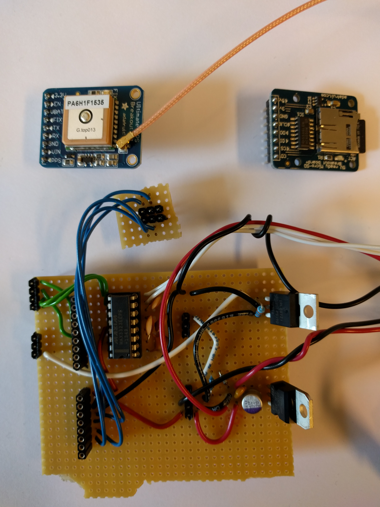
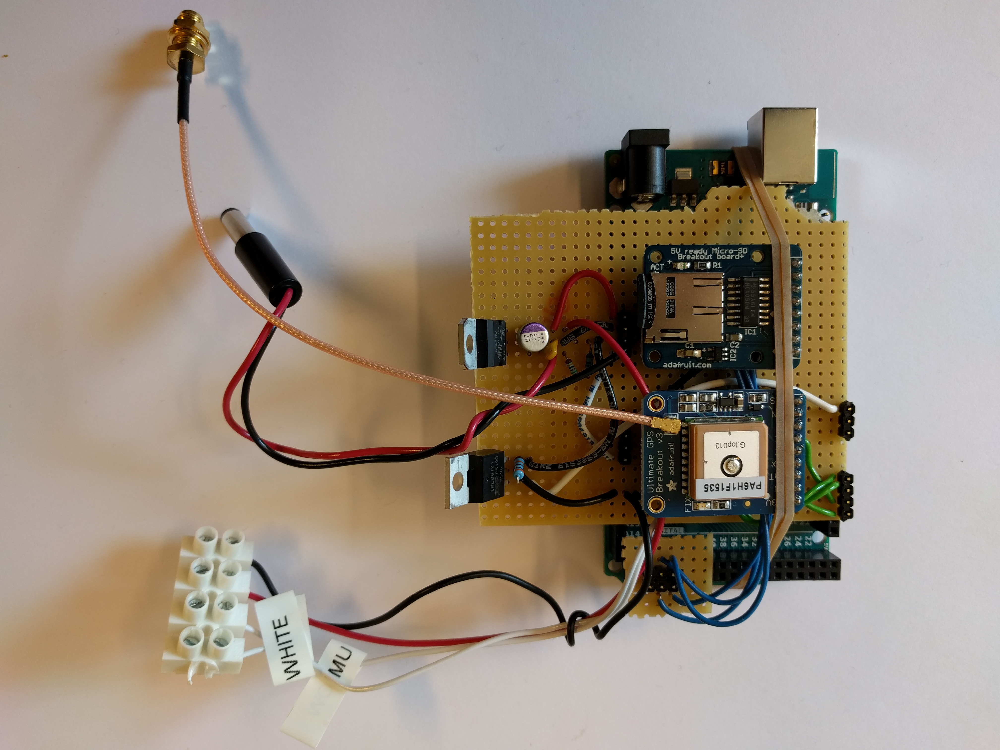
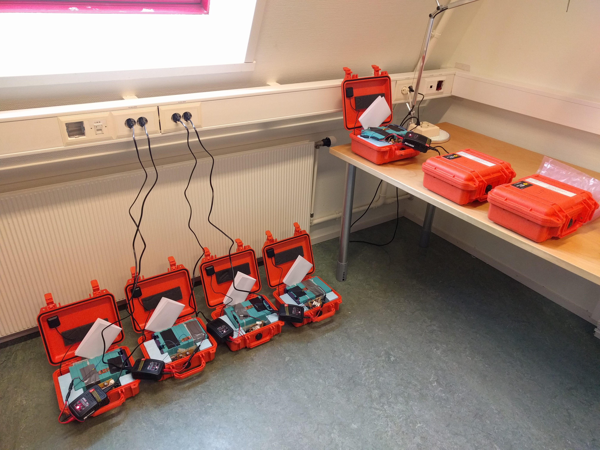

# Hardware

This is a summary of the electronics we use for building our loggers.

## Arduino

Arduino Mega (we use this model as it features 4 serial ports, which is convenient for our use).

## GPS

- We use the 'Adafruit Ultimate GPS Breakout - 66 channel w/10 Hz updates - Version 3': https://www.adafruit.com/product/746

- Together with an external active GPS antenna (also from Adafruit): https://www.adafruit.com/products/960

- And you will need a connector to be able to plug the external GPS antenna on the GPS breakout: https://www.adafruit.com/products/851

## SD card

- We use the 'MicroSD card breakout board' from Adafruit: https://www.adafruit.com/product/254

- And some cheap 8GB SD cards: https://www.adafruit.com/products/1294

## Soldered board

We assemble by hand a (very simple) soldered board that lets us connect together all the elements of the logger. The board is designed similarly to an Arduino shield, i.e. it is just inserted on top of the Arduino Mega. On the soldered board, we include a Low Dropout power regulator, a MOFSET that is used as a switch to give current to the GPS, SD card, and IMU, a converted chip to convert between 3V and 5V logics, and a divider of tension to measure from the Arduino the voltage of the battery. There is nothing to say about the board design, as it is a simple direct implementation of the wirings shown in the data sheet of each component.

We used the following electronics when building the soldered board:

- Low dropout voltage regulator: ST-microelectronics, L4941BV 5 V TO-220, see for example here: https://www.elfadistrelec.no/no/ldo-spenningsregulator-to-220-st-l4941bv/p/17313232?q=LDO+spenningsregulator+5V+TO220+L4941BV&page=1&origPos=1&origPageSize=50&simi=93.17
This is used to take the battery output from 6.4 to 5V.

- MOSFET: MOSFET N, 30 V 50 A 65 W TO-220, IRLB8721PBF, https://www.elfadistrelec.no/no/mosfet-30-50-65-to-220-ir-irlb8721pbf/p/17102381?q=MOSFET+N%2F30V+50A+65W+TO220+IRLB8721PBF&page=1&origPos=1&origPageSize=50&simi=82.17
This is used as a switch in order to be able to control the power supply to the SD card, GPS, GPS antenna and VN IMU.

- Resistance 1MOhm and 500kOhm: this is used to build a divider of tension on the soldered board, in order to be able to read the battery level (battery level should be typically around 6.4V down to 5.5V, but the Arduino Mega can only read tensions in the range 0 to 5V).

- MAX232 TTY / RS232 level conversion, MAX3323EEPE+, from Maxim: this is used to convert between 3V and 5V logics (necessary for the version of the VN100 we used): https://www.elfadistrelec.no/no/grensesnitt-ic-rs232-dil-16-maxim-max3323eepe/p/17307656

The GPS and SD card are inserted with connectors, so that a faulty module could easily be changed (this never happened to us). See pictures for more details (solderings are done on the tracks on the back of the board).

## Pelican case

Pelican cases 1200 are enough to accomodate the logger, IMU and batteries. We used some insulation foam cut to the right dimensions to hold in place all components.

